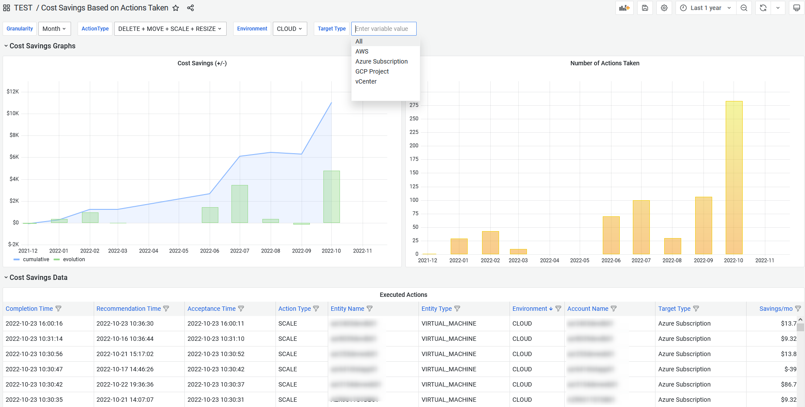

## Cost Savings based on Actions Taken

### You can change granularity of graphs (year, quarter, month, ...)
### Filters:
* Action Types
* Cloud / On-Prem / Both
* Target Type   /!\ This is a custom list of values: info is in a JSON field from PostGreSQL DB => doing a SELECT DISTINCT is quite heavy...

